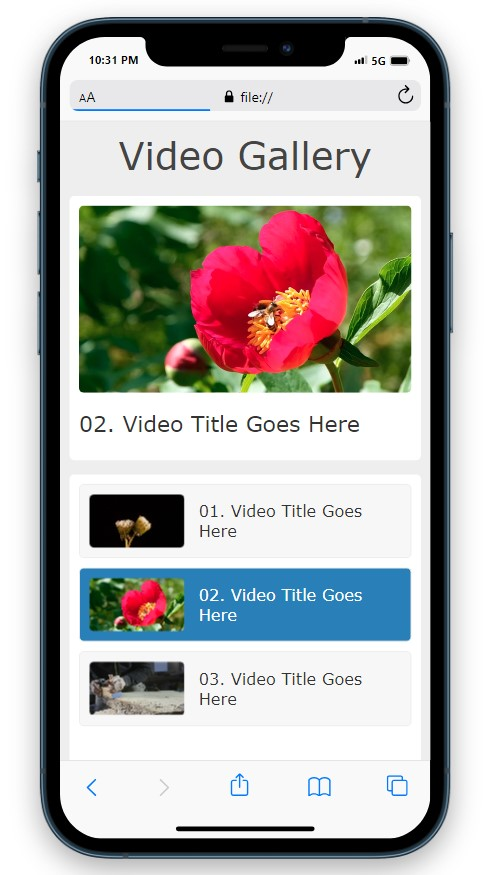
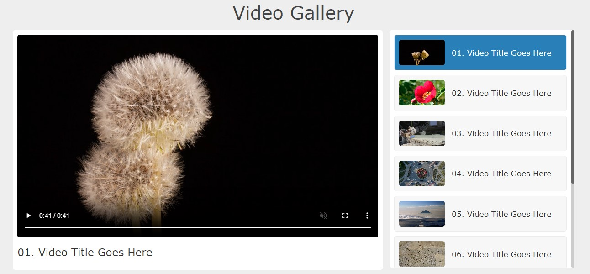

<!-- # My Best GitHub Project


<div align="center">
  <a href="https://github.com/yourusername/best-project">
    
  </a>

</div>
</div>
</div> -->
## Project Title
# Certificate validity project using django
# Project Description : 

- **The Certificate Validity Project using Django is a web application designed to streamline the process of verifying the authenticity and validity of digital certificates. With a user-friendly interface, it allows users to -**

## Project Version
- **Version:** 1.0.0 

## Project Demo Live Link

- **Live Demo:** [Not available](https://www.facebook.com/moniruldevelopers) 

## Project Images

 <!-- Replace with project screenshots -->


# How to Run This Project
-need internet connection
``` 
git clone repository link


pip install pipenv
pipenv shell
pipenv install django

python manage.py runsrver
```
# Installation Guideline Video

[](https://www.youtube.com/@techprosbd)


# Developer Information, Education, Previous Work Experience & Technology 
<div align="left">
  
</div>
<div style="display: flex; justify-content: space-between; align-items: flex-start;">
  <!-- Left Column - Developer Information -->
  <div style="flex: 1;"> 

## Developer Info
- **Name:** Monirul Islam
- **Email:** monirul.developers@gmail.com
- **YouTube:** [YouTube](https://www.youtube.com/@techprosbd)
- **Facebook:** [Facebook](https://www.facebook.com/monirul.developers)
- **LinkedIn:** [LinkedIn](https://www.linkedin.com/in/yourprofile)
- **WhatsApp:** 01575082901
- **Location:** Rajshahi, Bangladesh

## Work with Technology

-  
- 
-  
-  
-  
- 
-  


## Work with Company
| Company           | Position           | Duration        | Description                               |
| ----------------- | -------------------| --------------- | ----------------------------------------- |
| Nextzen Limited | Jr. Executive        | 1/1/2021 to now  | Sales software, communicate with customers, develop software|
| Pran RFL group Of Company | SR-Sales representative         | 8/8/2019- 2 months| Sales Product,communicate with customers 
| ...               | ...                | ...             | ...                                       |

</div>

  <!-- Right Column - Education -->
  <div style="flex: 1;">   

## Education
- **University:** University of global village, Barishal
- **Degree:** B.sc in Computer science and engineering 
- **Graduation Year:** 2024
- **Thesis:** Your Thesis (if applicable)
- **Projects:** Your Thesis (if applicable)
---
- **College:** Barguna Polytechnic institute, Barguna
- **Degree:** Computer science and technology 
- **Graduation Year:** 2019
- **Thesis:** Your Thesis (if applicable)
- **Projects:** Your Thesis (if applicable)
